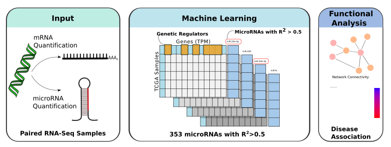

# Predict microRNA Expression from Gene Expression Data

This repository contains scripts to predict Reads Per Million (RPM) microRNA expression from Transcripts Per Million (TPM) unstranded gene expression data. The data used for training was derived from all matching microRNA and gene expression files from TCGA, including both cancer and normal samples. Refer to our preprint for more information: [DOI: 10.1101/2025.01.09.632215](https://doi.org/10.1101/2025.01.09.632215).



## Requirements
- Python 3

The following Python libraries are required:
- `pandas`
- `numpy`
- `sklearn`
- `argparse`
- `requests`
- `csv`
- `json`
- `re`
- `os`

Install them with:
```bash
pip install pandas numpy scikit-learn argparse requests
```

---

## Overview

The pipeline leverages matching gene expression and microRNA expression data to train models capable of predicting microRNA expression. 

### Input File Format
Your input gene expression file should have two columns:
- `gene_name`: The name of the gene.
- `expression_values`: TPM (transcripts per million) values for each gene.

Refer to the GDC mRNA pipeline documentation for more details: [GDC Documentation](https://docs.gdc.cancer.gov/Data/Bioinformatics_Pipelines/Expression_mRNA_Pipeline/).

---

## Example Usage

### Predicting microRNA Expression
Run the script `predict_microRNA_expression.py` with your input gene expression file and specify the output path for predictions.

```bash
python3 prediction/predict_microRNA_expression.py -i example_gene_counts.csv -o example_output.csv
```

---

## Training Your Own (TCGA-)Models

### 1. Download TCGA Data
To train your own models, prepare a table (e.g., `data/training_data/TCGA_barcodes.csv`) where:
- `features` correspond to gene expression File IDs.
- `labels` correspond to microRNA expression quantification File IDs.

Example usage:
```bash
python3 model_training/download_TCGA_files.py -i training_data/TCGA_barcodes.csv
```
This will create a folder `TCGA_data` with subfolders `features` and `labels`.

Extract and clean the downloaded files:
```bash
cd TCGA_data/features
tar -xvzf *
rm *.gz
cd ../labels
tar -xvzf *
rm *.gz
```

### 2. Process TCGA Data
To create the training matrices:
```bash
python3 model_training/process_TCGA.py
```
This will output two matrices:
- `raw_feature_matrix.csv`: Gene expression matrix.
- `raw_label_matrix.csv`: MicroRNA expression matrix.

### 3. Clean the Data
Filter the matrices to remove rows with too many zeros or NaN values. Here, `feature` refers to gene expression and `label` refers to microRNA expression:
```bash
python3 model_training/clean_data.py \
    --feature-matrix raw_feature_matrix.csv \
    --label-matrix raw_label_matrix.csv \
    --threshold-feature 10000 \
    --threshold-label 1050 \
    --output-dir data/training/
```
This will output cleaned matrices for training.

### 4. Train the Model
Train a Ridge Regression model using the cleaned data:
```bash
python3 model_training/model_training.py \
    --feature-matrix /path/to/cleaned_features.csv \
    --label-matrix /path/to/cleaned_labels.csv
```
This will create the following files in the `results` folder:
- `benchmarking_results_all.csv`
- `y_test_ypred_data_combined.csv`
- `weight_coefficients_all.csv`

### 5. Compute Intercepts
To prepare for predictions, compute the intercepts:
```bash
python3 model_training/compute_intercept.py \
    --feature-matrix /path/to/cleaned_features.csv \
    --label-matrix /path/to/cleaned_labels.csv \
    --coefficients /path/to/weight_coefficients_all.csv \
    --output-intercepts /path/to/intercepts.csv
```
This produces a file called `intercepts.csv` required for predictions.

---

## Folder Structure
- `data/benchmarking_metrics`: Contains benchmarking results of the provided models.
- `data/training_data`: Contains cleaned matrices for features (genes) and labels (microRNAs), as well as the TCGA_barcodes used.
- `data/weight_coefficients`: Contains the weights trained for all features and 3% most predictive features, as well as intercepts of training data that are being used for predictions.
- `prediction`: Provides the script for predicting microRNA expression and test input.
- `model_training`: Provides the scripts for both, reproducing the model coefficients provided and customized training of models.

---

## Custom Predictions
To predict with custom files, you must adapt the paths in the `predict_microRNA_expression.py` script accordingly.

---

## References
- Preprint: [DOI: 10.1101/2025.01.09.632215](https://doi.org/10.1101/2025.01.09.632215)

